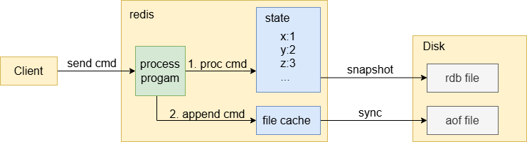

# 持久化

为了防止数据丢失，数据库一般都会有持久化策略。RDB 和 AOF 是 Redis 的两种持久化策略。   

**持久化流程图示:**    



客户端发送命令会触发读事件，处理程序读取命令后，先执行命令，更改内存数据，接着将命令追加到 AOF 日志中，并同步到磁盘中；同时后台进程进行快照操作，保存内存数据。    

注：一般数据库会被称作状态机（State Machine），其数据会被称作状态（State）。

### 1. RDB（Redis DB）
RDB 持久化就是将内存数据快照（snapshots）保存到磁盘中。    

**运行逻辑：**  
1、用户设置时间间隔和写操作的次数，在一个时间间隔内，达到指定的写操作次数，redis 主进程就会 fork 出 bgsave 子进程；  
2、bgsave 子进程启动后，在后台进行 snapshot 操作，将内存数据写入 RDB 文件，然后同步到磁盘上。   
```
static int serverCron(struct aeEventLoop *eventLoop, long long id, void *clientData) {
  ...
  /* Check if a background saving or AOF rewrite in progress terminated */
  if (server.bgsavechildpid != -1 || server.bgrewritechildpid != -1) {
    ...
  } else {
    /* If there is not a background saving in progress check if we have to save now */
    time_t now = time(NULL);
    for (j = 0; j < server.saveparamslen; j++) {
      struct saveparam *sp = server.saveparams+j;
      // server.dirty 是上一次保存 RDB 文件后，写操作的次数
      // server.lastsave 是上一次保存 RDB 文件的时间
      // 在指定的时间间隔内，写操作超过指定次数
      if (server.dirty >= sp->changes &&
        now-server.lastsave > sp->seconds) {
        redisLog(REDIS_NOTICE,"%d changes in %d seconds. Saving...",
            sp->changes, sp->seconds);
        rdbSaveBackground(server.dbfilename);
        break;
      }
    }
  }
}

static int rdbSaveBackground(char *filename) {
  pid_t childpid;
  if (server.bgsavechildpid != -1) return REDIS_ERR;
  // fork 出 bgsave 子进程
  if ((childpid = fork()) == 0) {
    /* Child */
    close(server.fd);
    // 子进程开始保存 RDB 文件
    if (rdbSave(filename) == REDIS_OK) {
        exit(0);
    } else {
        exit(1);
    }
  } else {
    /* Parent */
    ...
    server.bgsavechildpid = childpid;
    return REDIS_OK;
  }
  return REDIS_OK; /* unreached */
}

static int rdbSave(char *filename) {
  ...
  // 创建一个临时 RDB 文件
  snprintf(tmpfile,256,"temp-%d.rdb", (int) getpid());
  fp = fopen(tmpfile,"w");
  ...
  // 遍历 redis 所有的数据库
  for (j = 0; j < server.dbnum; j++) {
    redisDb *db = server.db+j;
    dict *d = db->dict;
    if (dictSize(d) == 0) continue;
    di = dictGetIterator(d);
    ...
    // 迭代所有数据项，写入到临时 RDB 文件
    while((de = dictNext(di)) != NULL) { 
      // 根据不同的数据类型进行处理，如Set、List、String等
      ...
    }
  }
  ...
  // 同步到磁盘文件中
  fflush(fp);
  fsync(fileno(fp));
  fclose(fp);
  // 进行 rename 操作，临时文件覆盖之前旧 RDB 文件，得到新 RDB 文件
  if (rename(tmpfile,filename) == -1) {
    ...
  }
  redisLog(REDIS_NOTICE,"DB saved on disk");
  // 重置写操作次数和更新保存时间
  server.dirty = 0;
  server.lastsave = time(NULL);
  return REDIS_OK;
}
```
Rename 作用：可以保证更新 RDB 文件操作具有原子性。只有当临时的 RDB文件成功生成，才能覆盖旧 RDB 文件，如果生成失败，不会影响到旧的文件，这样可以保证得到完整的 RDB 文件。    

### 2. AOF（Append-Only File）
AOF 持久化本质是写日志，日志记录了每次写操作。AOF 文件是一个日志文件。   

**运行逻辑：**   
每次写操作执行后，把写操作追加到日志缓存中，然后根据不同同步策略，判断当前是否需要同步（sync）到磁盘 AOF 文件。  

**三种同步策略**   
always：每次追加日志都立即同步到 AOF 文件，数据没有丢失风险，但性能较低；   
everysec：每秒同步一次 AOF 文件，性能较高，有数据丢失风险，最多丢失1秒的数据（两次同步操作之间的写入）；   
no：由系统控制何时同步 AOF 文件，性能最高，丢失风险也最大。

```
static int processCommand(redisClient *c) {
  ...
  dirty = server.dirty;
  // 执行操作
  cmd->proc(c);
  // 如果开启 AOF 持久化，判断是不是写操作
  if (server.appendonly && server.dirty-dirty)
    feedAppendOnlyFile(cmd,c->db->id,c->argv,c->argc);
}

static void feedAppendOnlyFile(struct redisCommand *cmd, int dictid, robj **argv, int argc) {
  ...
  // 写到文件缓存中
  nwritten = write(server.appendfd,buf,sdslen(buf));
  ...
  now = time(NULL);
  // 根据不同的同步策略，判断是否进行同步，server.lastfsync 保存了上次同步的时间
  if (server.appendfsync == APPENDFSYNC_ALWAYS ||
      (server.appendfsync == APPENDFSYNC_EVERYSEC &&
        now-server.lastfsync > 1))
  {
      fsync(server.appendfd); /* Let's try to get this data on the disk */
      server.lastfsync = now;
  }
}
```

问题：**AOF 与 WAL 都是通过写日志实现数据的持久化，两者机制有啥区别？**    

同步时机：  
AOF：写后日志，在数据写入内存后，再将写操作记录到日志文件中。   
WAL：写前日志，在数据实际写入之前，先将写操作同步到日志文件中。   

数据丢失风险：
在日志机制中，只有写操作日志同步到磁盘上，才能认为写操作是真正成功的。    
WAL：每次写操作都会先同步日志，数据不会有丢失的情况。   
AOF：即使开启 always，如果在最后一次写操作在内存数据中生效后，有线程访问了该数据，但在同步日志文件前，redis 程序出现崩溃，就会丢失该数据，出现数据不一致的情况。然而 redis 是单线程的，读写操作在一个线程里，具有天然的原子性，只有写内存数据和同步日志这两个操作完成后，才能处理读操作，所以可以认为 always策略不会丢失数据。